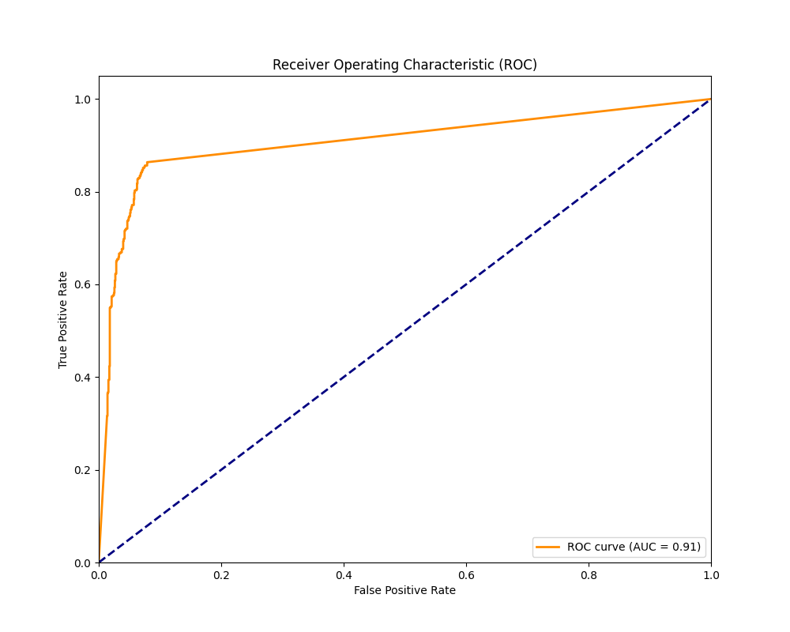
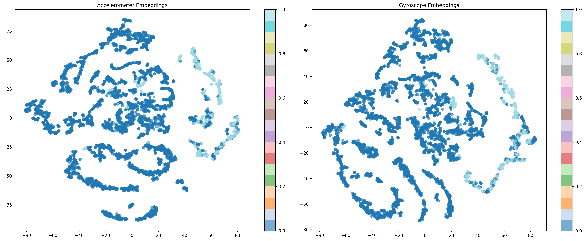
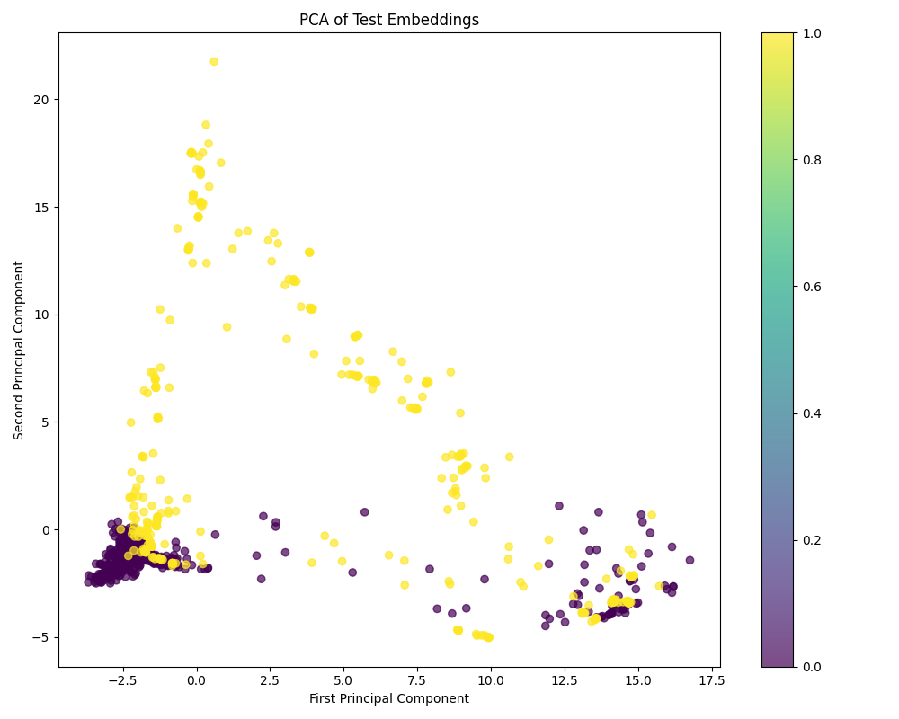
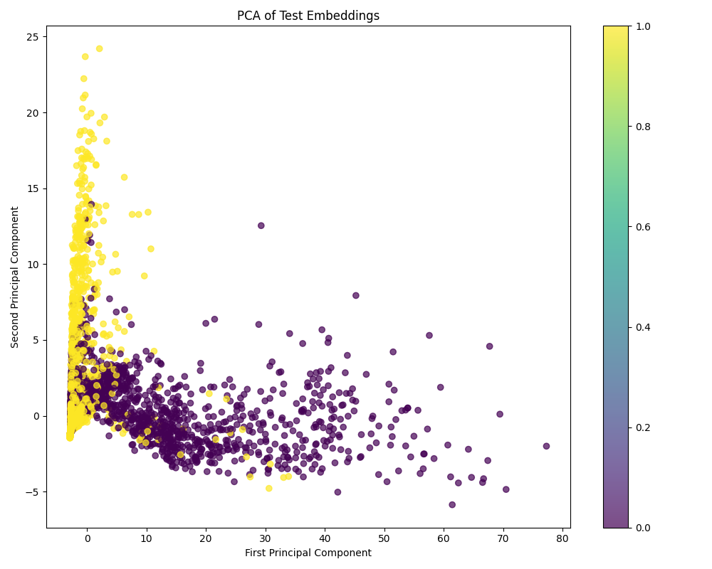

### Testing 1 (2025.01.15. ~ 2025.01.20.)

- (1) Handler code for MobiFall and SisFall datasets has been written
    - In MobiFall, unexpected missing values, like NaN values, were replaced with 0. When dividing the train, val, and test datasets, efforts were made to avoid class imbalance by keeping the FALL and ADL class ratios consistent and ensuring an even distribution of subjects across the splits.
    - Similarly, for SisFall, care was taken to prevent SA and SE from being overly concentrated in just one of the train, val, or test datasets.
    - Both datasets were structured using a sliding window, and only gyroscope and accelerometer sensor data were used.
    - Both datasets were downsampled to 50.
    - A Butterworth filter was applied to both datasets, but its necessity is still unclear.

- (2) Basic experimental setup (6-core i7 Intel / 32GB DDR4 / internal graphics (CPU))
    - | Category | Configuration |
      |------|---------|
      | Dataset | MobiFall, SisFall |
      | Loss function type | default |
      | Number of encoders | 1 |
      | Batch size | 64 |
      | Embedding dimension | 64 |
      | Learning rate | 0.001 |
      | Number of epochs | 200 |
      | Window width | 128 |
      | Training data ratio | 0.6 |
    - Trial and error
        - When using a learning rate of 0.01, all loss values in MobiFall turned into NaN. This seemed to be caused by learning being too fast, preventing proper optimization. The learning rate was reduced to 0.001, and the experiments continued.
        - Setting the training data ratio to 1.0 resulted in an estimated training time of around 2 hours and 30 minutes for SisFall. Therefore, the ratio was adjusted to 0.6 for further experiments.

- (3) Experimental results
    - Accuracy and F1 score
        - MobiFall
            - ```sh
                Validation Metrics:
                Accuracy: 89.74%
                F1 Score: 0.8988
                Confusion Matrix:
                [[2494  183]
                [ 146  383]]

                Test Metrics:
                Accuracy: 89.30%
                F1 Score: 0.8885
                Confusion Matrix:
                [[1278   50]
                [ 136  275]]
                ```
        - SisFall
            - ```sh
                Validation Metrics:
                Accuracy: 80.51%
                F1 Score: 0.8033
                Confusion Matrix:
                [[3026  453]
                [ 738 1893]]

                Test Metrics:
                Accuracy: 80.23%
                F1 Score: 0.7994
                Confusion Matrix:
                [[4103  522]
                [1081 2404]]
                ```
    - ROC lines
        - MobiFall
            - 
        - SisFall
            - 
    - Embeddings visualization using t-SNE
        - MobiFall
            - 
        - SisFall
            - 
        - Since both MobiFall and SisFall are time-series data, their distribution appears sequentially aligned, which seems to be a meaningful visual representation (in my opinion).
    - Test data embeddings visualization using t-SNE
        - MobiFall
            - 
        - SisFall
            -  

- (4) Future experiments to be conducted
    - Try cross-dataset validation. For example, train on MobiFall and test on SisFall (since both datasets have been formatted in the same way).
    - Increase the number of encoders and add skip connections to see if creating more compressed embeddings improves performance as the number of encoders grows.
    - Experiment with ResNet, transformer-encoder, or U-Net to improve information compression.
    - Urgent tasks
        - Compare performance across different loss types: default, nt_xent, and triplet.
        - Test performance with different batch sizes: 64, 128, 256.
        - Test performance with different embedding dimensions: 64, 128, 256.
        - Check how applying or removing the Butterworth filter affects performance.

