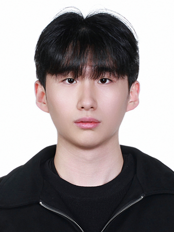

  

**Gyuyeon Lim**  
lky473736@icloud.com

- **HAR**
    - testing 2 : running only one encoder(EarlyFusion) CAGE with each dataset
    - testing 3 : real CAGE (contrastive learning)
    - testing 4 : no classifier, just using embedding value -> KNN, SVM
    - testing 5 : introduce nt_xent_loss and triplet_loss at model
    - testing 6 : will increasing the number of encoders and skip connections lead to better compression of embeddings and improved performance?
    - testing 7 : binary classifying (standing/jumping, standing/running)

- **fall_detection**
    - testing 1 : running mobifall and sisfall | default_loss | enc 1 | lr 0.001 | b 64 | dim 64 | ep 200
    - testing 2 : for each embedding dimensions (8, 16, 32, 64, 128)
