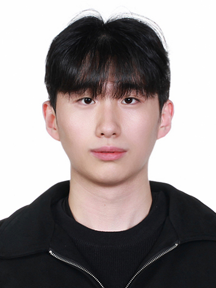

  

**Gyuyeon Lim**  
lky473736@icloud.com

### supervised
- **HAR** 
    - testing 1 : none
    - testing 2 : running only one encoder(EarlyFusion) CAGE with each dataset
    - testing 3 : real CAGE (contrastive learning)

### semi-supervised 
- **about way of learning and getting performance**
    - training each encoder(accel, gyro) for reducing ssl_loss (similar behavior must be close and have similar embedding value inside)
    - -> using KNN (use label) classifier
- **HAR**
    - testing 1, 2, 3 : none
    - testing 4 : no classifier, just using embedding value -> KNN, SVM
    - testing 5 : introduce nt_xent_loss and triplet_loss at model
    - testing 6 : will increasing the number of encoders and skip connections lead to better compression of embeddings and improved performance?
    - testing 7 : binary classifying (standing/jumping, standing/running)
- **fall_detection**
    - testing 1 : running mobifall and sisfall | default_loss | enc 1 | lr 0.001 | b 64 | dim 64 | ep 200
    - testing 2 : for each embedding dimensions (8, 16, 32, 64, 128) : MobiFall, SisFall, UMAFall, KFall
    - testing 3 : improve performance using other architecture on encoder : PCA, transformer-encoder, U-Net, serial connection of encoder with skip connections

### unsupervised 
- **about way of learning and getting performance**
    - training each encoder(accel, gyro) for reducing ssl_loss (similar behavior must be close and have similar embedding value inside)
    - -> using K-Means 
- **fall_detection**
    - testing 1 : running sample (default encoder at original CAGE) : MobiFall, SisFall, UMAFall (enc1, default loss, lr0.001, b64, dim64, ep200)
    - testing 2 : 
    - testing 3 : 