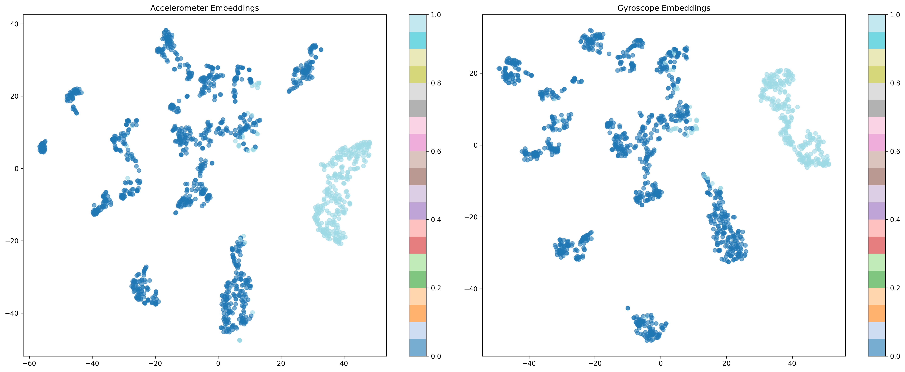
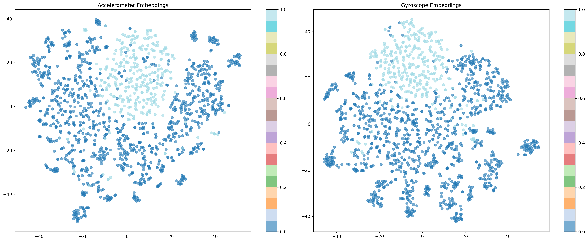
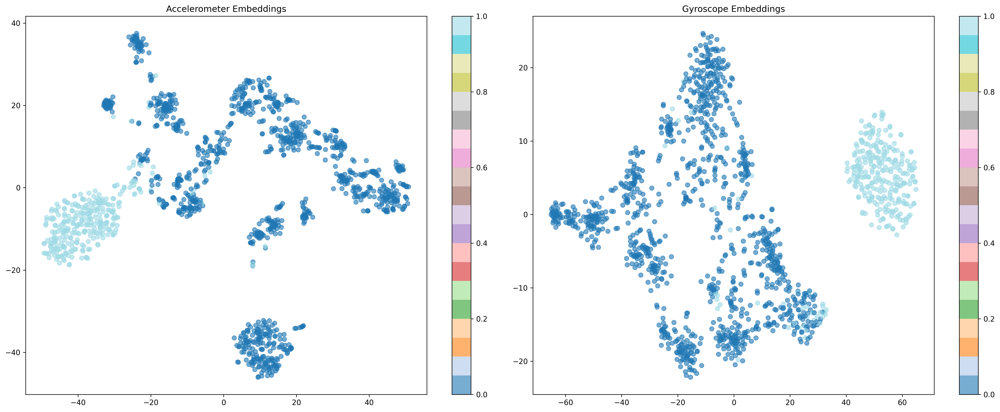
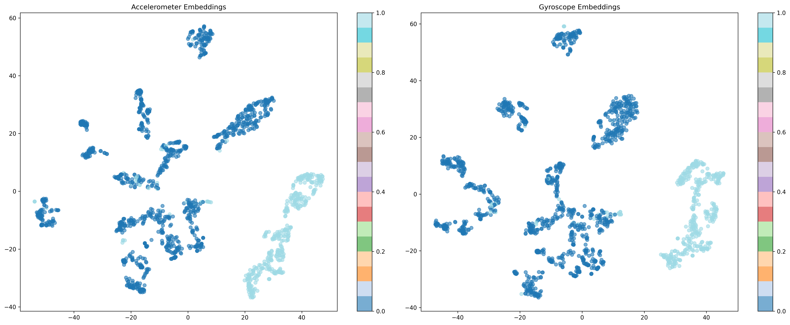
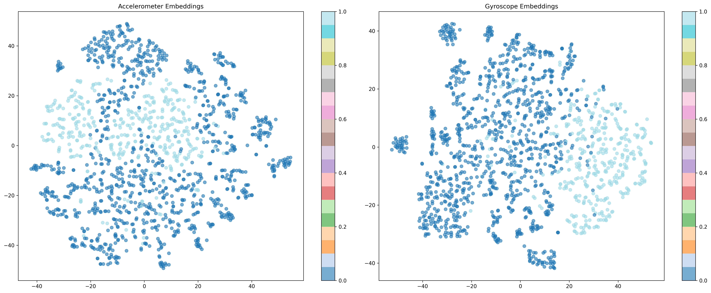
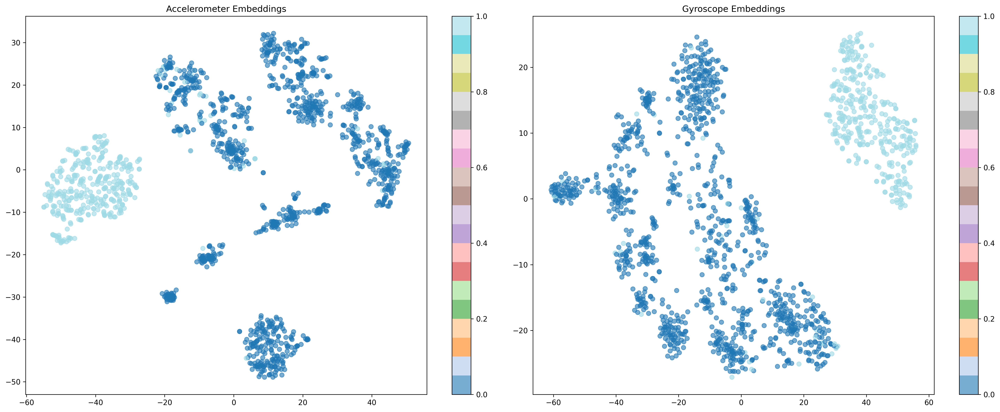

### binary classifying (standing/jumping)
- <b>acc is very high, BUT...</b>
    - There was only one sample of "jumping" in the validation set, and all loss functions failed to predict it during testing
    - So i tried standing/running binary classifying

| loss(labels) | acc(test) | f1(test) |
|----------|---------|--------|
| default(standing/jumping) | Accuracy: 97.92% | F1 Score: 0.9792 |
| nt_xent(standing/jumping)  | Accuracy : 97.92% | F1 Score : 0.9792 |
| triplet(standing/jumping)  | Accuracy : 91.67% | F1 Score : 0.9466 |

#### default tSNE visualization(standing/jumping)

#### nt_xent tSNE visualization(standing/jumping)

#### triplet tSNE visualization(standing/jumping)

--------

### binary classifying (standing/running)

| loss(labels) | acc(test) | f1(test) |
|----------|---------|--------|
| default(standing/running)  | Accuracy: 96.74% | F1 Score: 0.9674 |
| nt_xent(standing/running)  | Accuracy : 92.93% | F1 Score : 0.9291 |
| triplet(standing/running)  | Accuracy : 84.24% | F1 Score : 0.8401 |

#### default tSNE visualization(standing/running)

#### nt_xent tSNE visualization(standing/running)

#### triplet tSNE visualization(standing/running)
