### unsupervised : Testing 1 (2025.01.27.)
#### running sample (default encoder at original CAGE) : MobiFall, SisFall, UMAFall (enc1, default loss, lr0.001, b64, dim64, ep200)

- **Analysis Result**
    - **Worst of the worst.** Looking at the confusion matrix, it seems that the classification is completely off. Thinking about the possible reasons, I came up with the following ideas
        - changes way of clustering
            - DBSCAN
        - Is the encoder too weak? Is the embedding quality poor?
            - transformer-encoder
            - U-net
            - ResNet block
            - ResNet block + transformer
            - autoencoder-encoder
            - N-connected encoder + skip-connections
        - other losses?
            - triplet
            - nt_xent 

- **(1) experiment :  (6-core i7 Intel / 32GB DDR4 / internal graphics (CPU))**

    - basic condition : encoder 1, default loss, learning rate 0.001, batch size 64, epoch 200, train data usage 0.6, No butterworth filter

| **Embedding Dimension** | **MobiFall** |  | **SisFall** |  | **UMAFall** | | **KFall** | |
|--------------------|----------|----------|----------|----------|----------|----------|----------|----------|
|  test score of best model | F1 Score | Accuracy | F1 Score | Accuracy | F1 Score | Accuracy | F1 Score | Accuracy |
| 64                        | 0.6613   |  76.37%  |  0.4142  |  57.02%  | 0.5394   | 67.14%   |          |          |

- **(2) Confusion Matrix Analysis : Visualization of Confusion Matrices for Each Experiment**

| Embedding Dimension | MobiFall | SisFall | UMAFall | KFall |
|--------------------|----------|----------|---------|--------|
| 64                 |   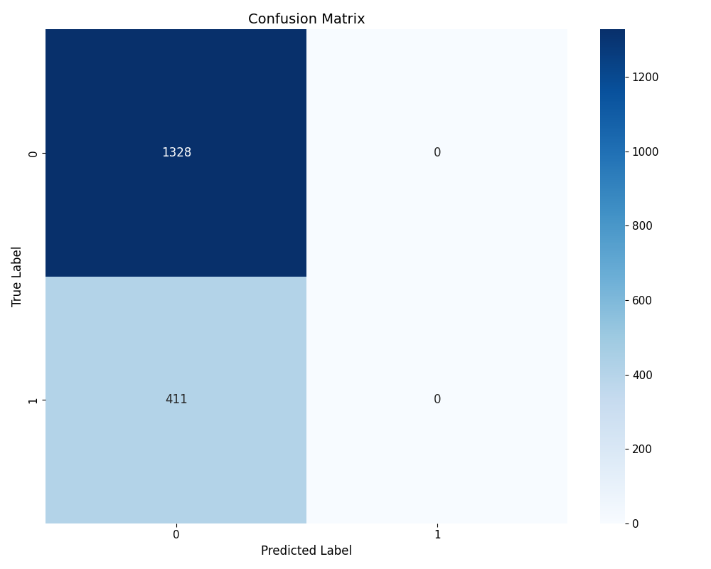      |      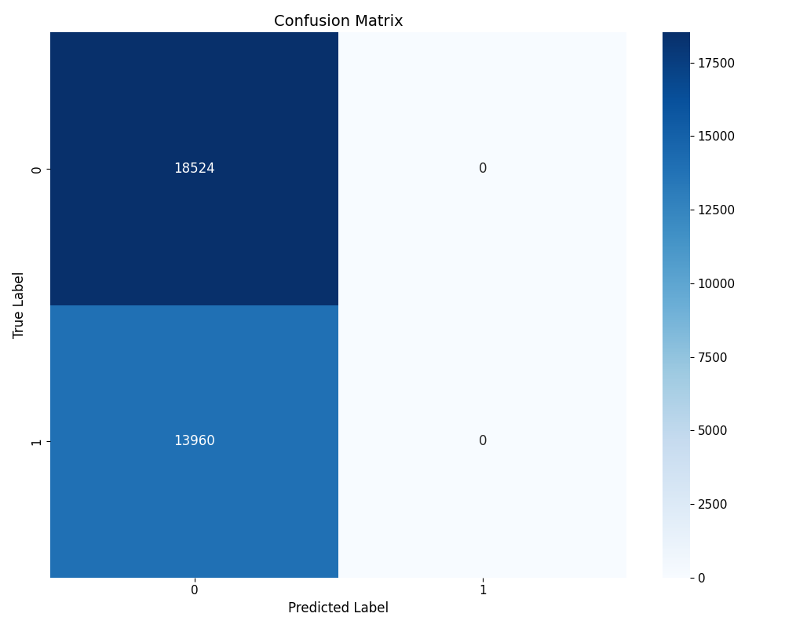      | 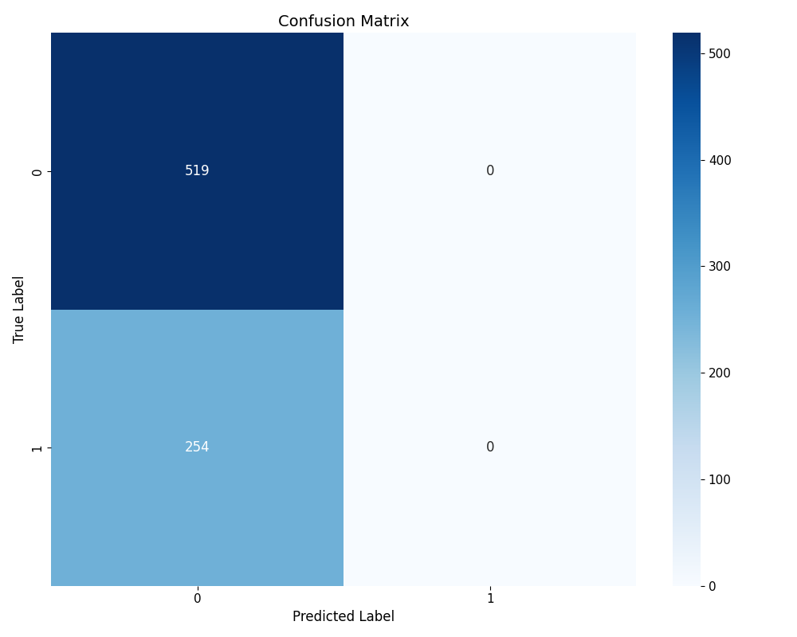  |  |

- **(3) t-SNE Visualization of Embeddings: : t-SNE Visualization of Embedding Spaces for Each Experiment**

| Embedding Dimension | MobiFall | SisFall | UMAFall | KFall |
|--------------------|----------|----------|--------|--------|
| 64                 |   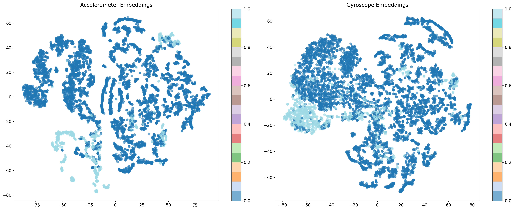      |            |  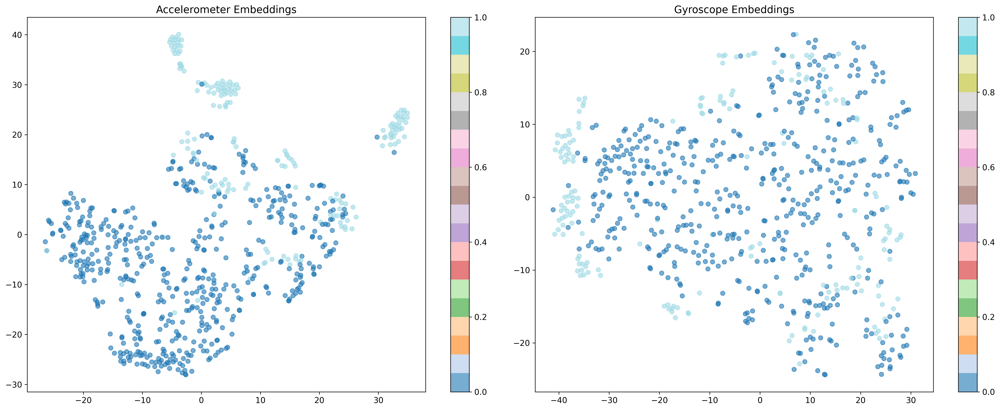   | |

- **(4) SSL Loss Progression : Self-Supervised Learning Loss Curves Across Training**

| Embedding Dimension | MobiFall | SisFall | UMAFall | KFall |
|--------------------|----------|----------|--------|--------|
| 64                 |   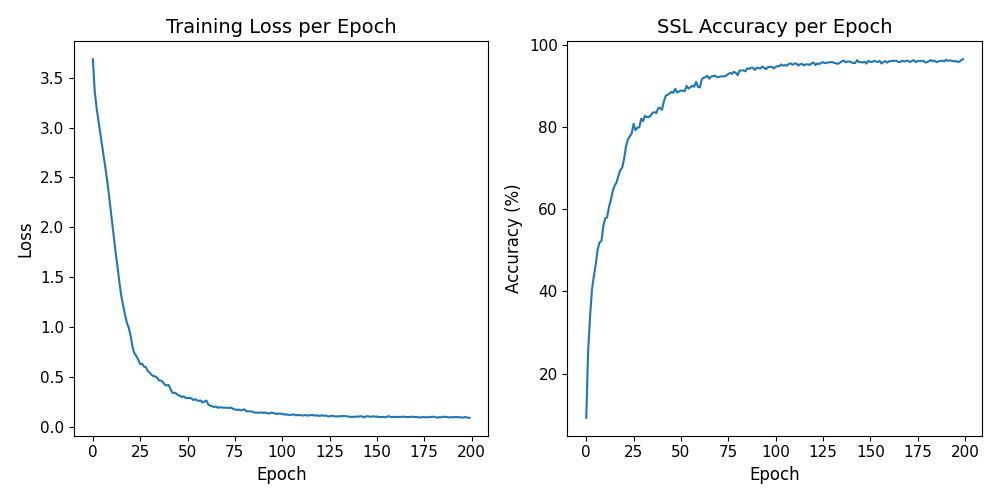      |      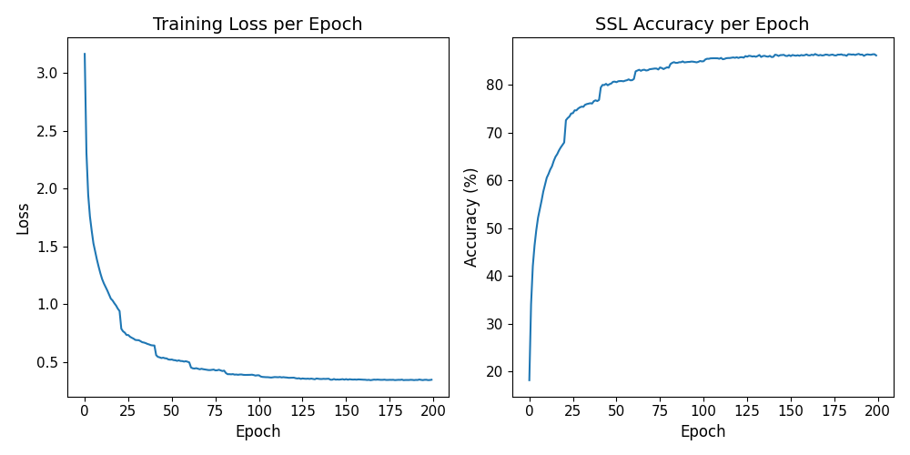      |    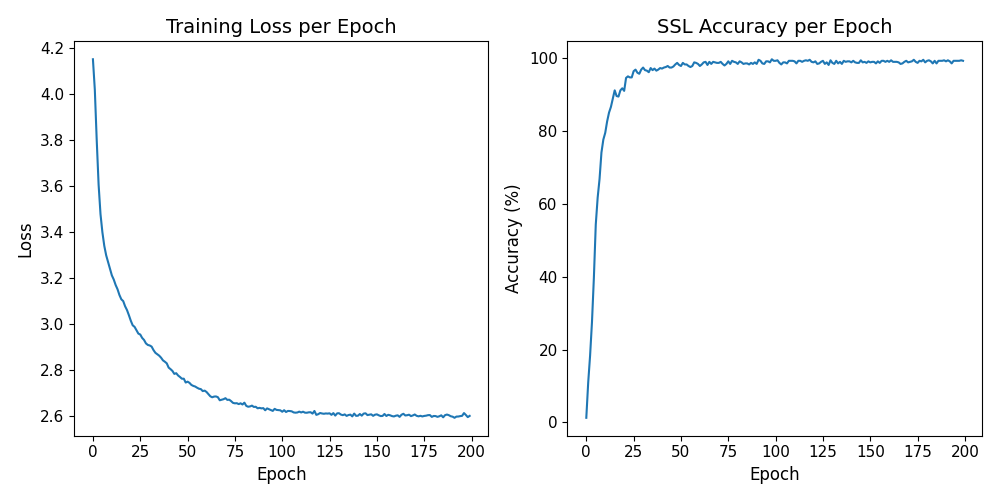   | |

- **(5) PCA embeddings : Visualization Test Datas' embeddings**

| Embedding Dimension | MobiFall | SisFall | UMAFall | KFall |
|--------------------|----------|----------|--------|--------|
| 64                 |   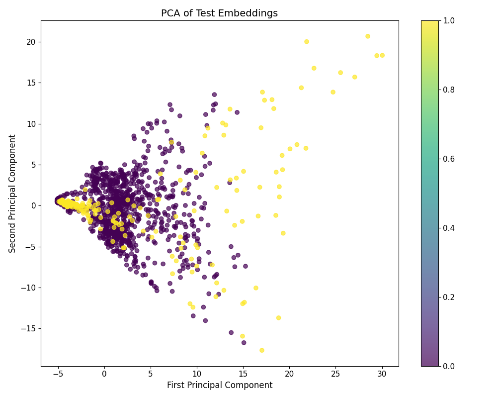      |      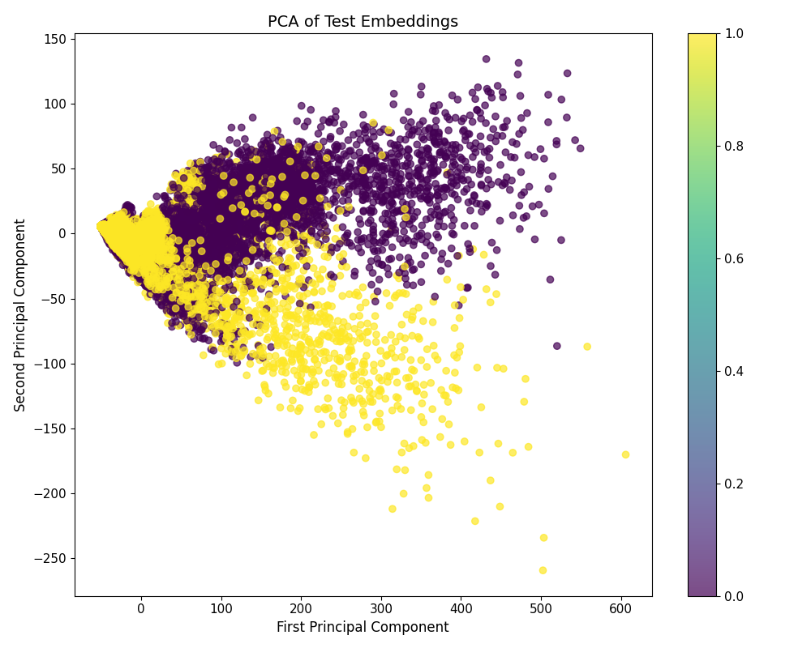      |    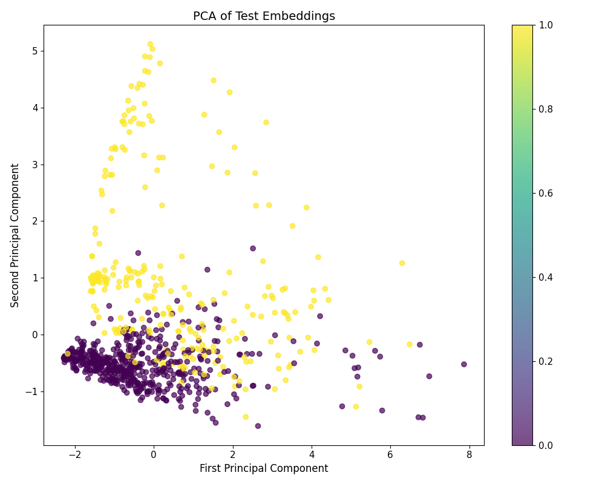   | |